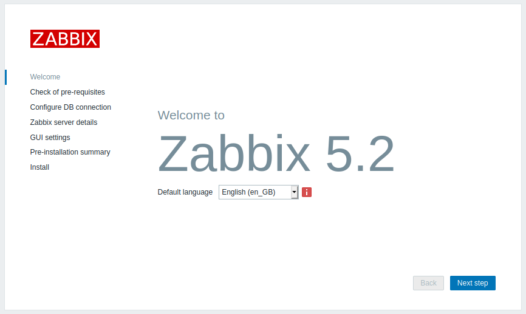
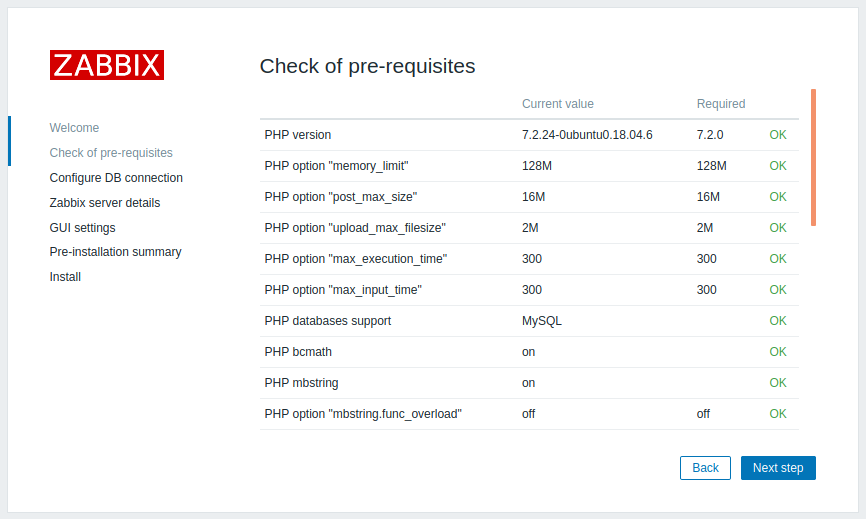
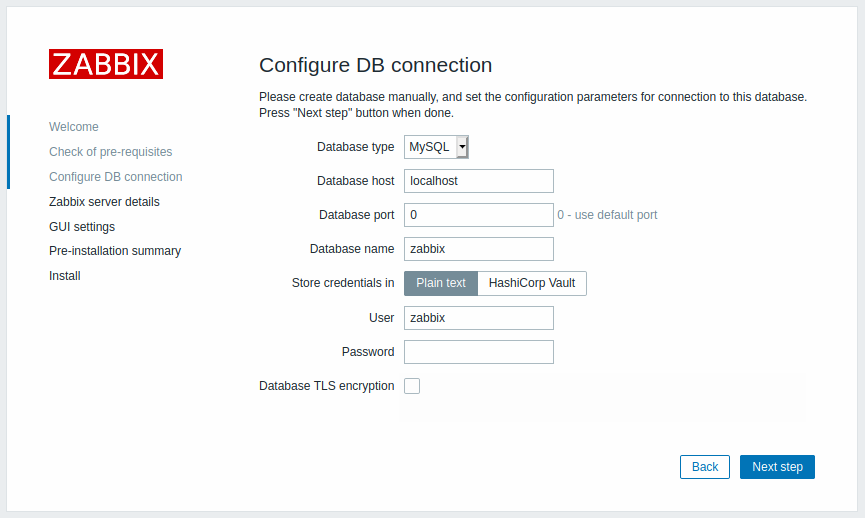
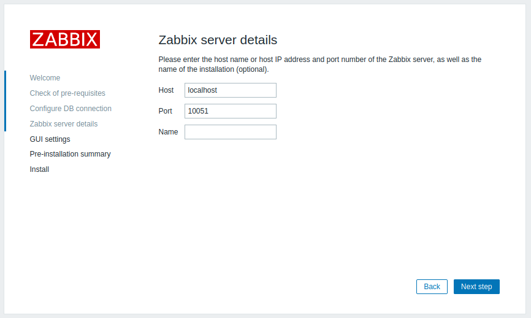
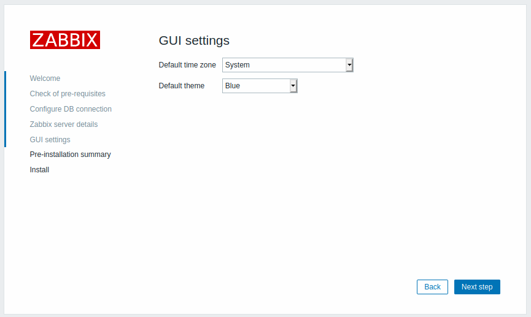
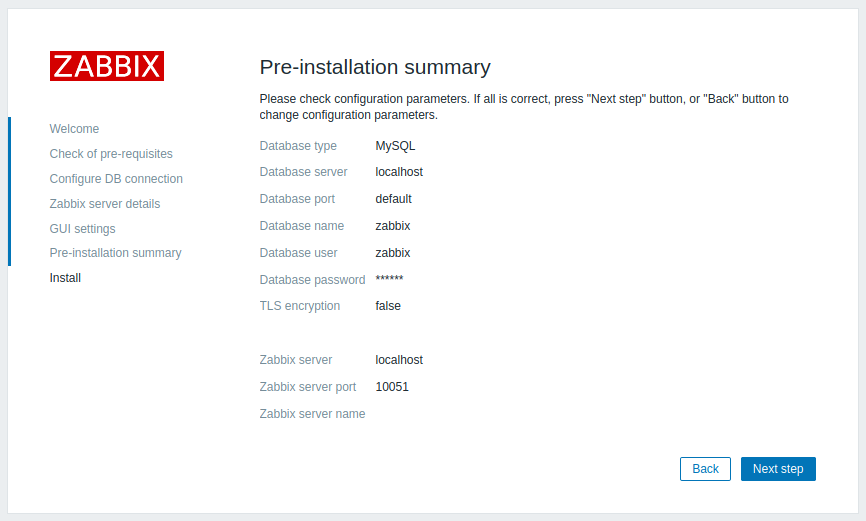
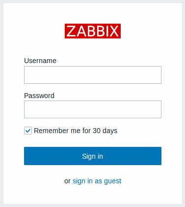

# Installation de Zabbix
- [Installation de Zabbix](#installation-de-zabbix)
  - [Installation CLI](#installation-cli)
    - [Apache2 et PHP7.3](#apache2-et-php73)
    - [MySQL (MariaDB)](#mysql-mariadb)
    - [Configuration et systemd](#configuration-et-systemd)
  - [Installation Web](#installation-web)

## Installation CLI

### Apache2 et PHP7.3 
Installation du serveur web et du php:
```bash
# apt install apache2 php php-mysql php-mysqlnd php-ldap php-bcmath php-mbstring php-gd php-pdo php-xml libapache2-mod-php
# systemctl status apache2
```  

### MySQL (MariaDB)
Création de l'utilisateur zabbix et de sa base de données: 
```bash
# apt install mariadb-server mariadb-client
# mysql_secure_connection
# mysql -uroot -p

MariaDB [(none)]> create database zabbix character set utf8 collate utf8_bin;
MariaDB [(none)]> create user zabbix@localhost identified by 'motdepasse';
MariaDB [(none)]> grant all privileges on zabbix.* to zabbix@localhost;
MariaDB [(none)]> quit;

# zcat /usr/share/doc/zabbix-server-mysql*/create.sql.gz | mysql -uzabbix -p zabbix 
```

### Configuration et systemd
Modifier le fichier /etc/zabbix/zabbix_server.conf:
```
DBPassword=motdepasse
```

Redémarrer et activer le service zabbix:
```bash
systemctl restart zabbix-server zabbix-agent apache2
systemctl enable zabbix-server zabbix-agent apache2 
```

## Installation Web

On commence par choisir le langage par défaut (anglais):


Ensuite nous est présenté une liste de tous les pré-requis nécéssaires au fonctionnement de zabbix sur le serveur web :


Le menu suivant permet de configurer l'accès à la base de données :



La quatrième étape sert à renseigner l'adresse IP et le port du serveur Zabbix : 


L'étape suivante permet de régler la zone de temps et le thème de l'interface web :



L'avant dernière étape est un résumé des paramètres choisis durant cette configuration :


La dernière étape est la confirmation de l'installation.

Une fois cette configuration terminée il suffit de cliquer sur le bouton Finish en bas à droite qui nous renverra sur la page de connexion, par défaut le nom d'utilisateur est Admin et le mot de passe est zabbix :

